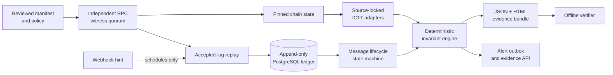

<div align="center">

# ictt-sentinel

**Keyless, read-only assurance and reproducible evidence for Avalanche ICTT deployments**

[](https://github.com/sayweer/ictt-sentinel/actions/workflows/ci.yml)


[Quick start](#quick-start) · [How it works](#how-it-works) · [Security model](#security-model) · [Documentation](#documentation)

</div>

> [!IMPORTANT]
> **Release status: Technical Preview.** The pure invariant engine, evidence verifier, live
> deployment doctor, live remote discovery, accepted-log replay, alert outbox, hosted evidence
> API, and read-only console are implemented and tested. Live RPC observations are not yet wired
> into an end-to-end economic evidence bundle, so this release must not be presented as a
> production or mainnet safety system.

## What is ictt-sentinel?

`ictt-sentinel` is an open-source technical-preview assurance toolkit for
[Avalanche Interchain Token Transfer (ICTT)](https://build.avax.network/docs/cross-chain/interchain-token-transfer/overview)
deployments. It helps an operator answer four questions:

1. **Am I reading the chains and contracts I intended to read?**
2. **Do independent RPC witnesses agree on the accepted, pinned state?**
3. **Do home-side accounting, remote supply, and message execution reconcile?**
4. **Can another person reproduce the verdict from the exported evidence?**

The toolkit is deliberately keyless. It cannot sign, submit, retry, mint, burn, upgrade, or pause
anything. A webhook may trigger faster collection, but it can never become chain truth.

## Why this exists

An ICTT deployment spans multiple chains and multiple contracts. A single explorer page can look
healthy while the shared accounting is not: a remote may be unapproved, a proxy implementation may
drift, providers may disagree, a message may be delivered but fail during application execution, or
remote supply may exceed the corresponding home-side accounting.

Avalanche's ICTT model also permits remote contracts to be registered permissionlessly and places
the responsibility for evaluating them on users of the home contract. The official
[ICTT documentation](https://build.avax.network/docs/cross-chain/interchain-token-transfer/overview)
describes that trust boundary. `ictt-sentinel` turns the operator's evaluation into a repeatable,
fail-closed process.

| Typical approach | What can be missed | What ictt-sentinel adds |
|---|---|---|
| One RPC or explorer | Provider error, stale history, chain identity mismatch | Independent trust-domain quorum and explicit block pins |
| Message status alone | Delivery confused with successful execution | Separate delivery, execution, retry, and economic-effect states |
| Dashboard-only monitoring | A result without replayable inputs | Canonical JSON/HTML evidence and an offline verifier |
| Current on-chain topology | Permissionless registration treated as approval | Reviewed manifest baseline and candidate-only discovery |
| Generic bridge alerts | ICTT decimal, collateral, and accounting semantics | Source-locked ICTT adapters and mode-specific invariants |

## What it provides

### Assurance engine

- Canonical ERC-20 reconciliation and coverage rules using exact `bigint` arithmetic.
- Native-remote upper-bound assessment with deliberately narrower claims.
- A verdict lattice of `OK`, `WARN`, `CRITICAL`, and `UNKNOWN`.
- Fail-closed handling for missing history, incomplete census, unknown fingerprints, unsupported
  transfer shapes, and provider disagreement.
- A Teleporter message state machine that never equates delivery with execution.

### Data and runtime

- Query-only RPC operations from a closed method allowlist.
- Explicit block-number and block-hash pins for comparative reads.
- Quorum counted across independent `trustDomain` values, never URL count.
- Resumable accepted-log replay with atomic PostgreSQL checkpoints.
- Append-only raw facts, typed data-quality incidents, freshness degradation, and crash recovery.
- Slack, PagerDuty, and generic webhook alert delivery through a durable outbox.

### Evidence and operator surfaces

- Deterministic JSON evidence bundles and derived HTML reports.
- Offline verification that replays the pure rule engine from self-contained inputs.
- A CLI for fixtures, configuration checks, discovery, replay, and evidence workflows.
- A local watcher agent with health and metrics endpoints.
- An optional hosted evidence API and a same-origin, read-only operator console.
- A deterministic failure lab, SBOM, dependency-license inventory, and reproducible-build gate.

## Verdicts

| Verdict | Meaning | Operator response |
|---|---|---|
| `OK` | Every required control is complete, fresh, and passing | Continue monitoring |
| `WARN` | A supported policy or liveness deviation needs review | Investigate during the defined response window |
| `CRITICAL` | Sufficient evidence proves an invariant breach | Start the incident runbook |
| `UNKNOWN` | A required fact or trust condition could not be established | Treat it as a blind spot; never as healthy |

CLI exit codes preserve that distinction: `0` = OK, `2` = CRITICAL, `3` = UNKNOWN,
`4` = WARN, `5` = invalid input, and `6` = internal failure.

## How it works



The manifest is the reviewed statement of what a deployment is supposed to be. Discovery produces
a candidate and a diff; it never approves a remote. RPC endpoints are grouped by declared failure
domain, then reads are accepted only when the required independent witnesses agree. Every economic
comparison names both the block number and hash used on each chain.

Contract interpretation is tied to the pinned
[`ava-labs/icm-services`](https://github.com/ava-labs/icm-services) source revision documented in
[`docs/PROTOCOL_SOURCE_LOCK.md`](docs/PROTOCOL_SOURCE_LOCK.md). An unknown runtime or proxy
implementation produces `UNKNOWN`; it is never decoded as the nearest known version.

## Security model

`ictt-sentinel` is designed so monitoring access cannot become token-control access.

- No private key, mnemonic, wallet, signer, transaction envelope, or chain-write method exists in
  the product path.
- Startup refuses environments that contain known signing-secret names.
- Manifests hold environment-variable **names**, not endpoint URLs or credentials.
- RPC calls pass through a closed query-only allowlist; there is no public generic
  `request(method, params)` API.
- The local stack runs non-root with a read-only filesystem, dropped capabilities, bounded
  resources, and no-new-privileges.
- Hosted sharing defaults to `local-only`. Enabling the hosted plane does not silently expand what
  leaves the operator's machine.

The complete threat model is in [`docs/SECURITY.md`](docs/SECURITY.md). Please use
[`SECURITY.md`](SECURITY.md) for responsible disclosure.

## Quick start

### Prerequisites

- Node.js `24.20.0` (pinned in `.nvmrc` and `.node-version`)
- pnpm `11.10.0` (pinned in `package.json`)
- Git
- Docker, only for PostgreSQL and container workflows

```bash
git clone https://github.com/sayweer/ictt-sentinel.git
cd ictt-sentinel

nvm use
corepack enable
pnpm install --frozen-lockfile --ignore-scripts
pnpm run build
```

Run the complete local quality gate:

```bash
pnpm run verify
```

### See all three outcomes offline

These fixtures are fictional, deterministic, and require no RPC endpoint, credential, or database.

```bash
# Reconciled canonical ERC-20 -> OK, exit 0
pnpm --silent run cli -- check --fixture healthy

# Independent witnesses disagree -> UNKNOWN, exit 3
pnpm --silent run cli -- check --fixture disagreement

# Remote supply exceeds accounting -> CRITICAL, exit 2
pnpm --silent run cli -- check --fixture deficit
```

Export evidence and verify it offline:

```bash
pnpm --silent run cli -- evidence export --fixture healthy
pnpm --silent run cli -- evidence verify \
  --file evidence-out/healthy.evidence.json
```

The export contains canonical JSON and a human-readable HTML report. The JSON is written
atomically with private file permissions. The verifier checks the bundle structure and hashes,
then reruns the pure invariant engine. A bundle is reproducible and audit-shareable; it is not an
external signature or tamper-proof attestation.

### Exercise resumable replay

```bash
pnpm --silent run cli -- replay --fixture healthy --max-facts 1
# Incomplete range -> UNKNOWN, exit 3

pnpm --silent run cli -- replay --fixture healthy --max-facts 1 --resume
# Remaining fact commits -> OK, exit 0
```

The checkpoint is bound to the exact bundle hash. A gap or disagreement cannot advance it.

## Use a real deployment

> [!WARNING]
> Real-deployment use is a shadow-pilot workflow. The example manifest contains fictional
> addresses and hashes. Replace every deployment-specific value and review the resulting baseline
> before relying on any output.

1. Copy the templates and fill in your chain identities, contracts, deployment blocks, fingerprints,
   and policy:

   ```bash
   cp config/deployments/example.ictt.yml deployment.yml
   cp config/policies/default.yml policy.yml
   cp .env.example .env.local
   ```

2. Provide at least two operationally independent RPC trust domains per chain. Keep RPC URLs in
   your secret manager or local environment; put only their `secretRef` names in the manifest.

3. Create a `pins.json` file containing an explicit accepted block number and hash for every chain:

   ```json
   [
     {
       "blockchainId": "0x<64 lowercase hex characters>",
       "blockNumber": "123456",
       "blockHash": "0x<64 lowercase hex characters>"
     }
   ]
   ```

4. Verify chain identity, accepted-state behavior, archive access, proxy slots, and source-locked
   fingerprints:

   ```bash
   pnpm run cli -- doctor \
     --manifest deployment.yml \
     --policy policy.yml \
     --pins pins.json
   ```

5. Scan one policy-bounded registration range and review the candidate diff. Repeat with `--resume`
   until the configured range is complete:

   ```bash
   pnpm run cli -- discover \
     --manifest deployment.yml \
     --policy policy.yml \
     --pins pins.json \
     --json
   ```

Discovery never edits or approves the baseline. A human must verify addresses, chain identities,
proxy implementations, code hashes, decimals, census coverage, and RPC independence.

Configured `check`, `replay`, and `evidence export` currently consume a pre-built evidence bundle:

```bash
pnpm run cli -- check \
  --manifest deployment.yml \
  --policy policy.yml \
  --file captured.evidence.json \
  --offline
```

The live doctor and discovery paths are implemented. The watcher performs live accepted-log replay,
freshness tracking, persistence, and alert delivery. Building the economic evidence input directly
from those live observations remains the main technical-preview gap.

For the full operator sequence, database role separation, controlled failure demos, and evidence
handoff checklist, follow [`docs/PILOT_ONBOARDING.md`](docs/PILOT_ONBOARDING.md).

## Local services

The Docker Compose stack contains PostgreSQL, a migration job, the watcher agent, and the optional
hosted API. Services bind to loopback in the development configuration.

```bash
# Database only
docker compose \
  --env-file .env.local \
  -f infra/postgres/docker-compose.yml \
  up -d ictt-sentinel-postgres

# Render and validate the hardened service configuration
pnpm run verify:containers
```

Agent and API profiles require the additional DSNs, mounted manifest/policy paths, and service env
files documented in [`docs/PILOT_ONBOARDING.md`](docs/PILOT_ONBOARDING.md) and
[`docs/DEVELOPMENT.md`](docs/DEVELOPMENT.md).

## Repository map

| Path | Responsibility |
|---|---|
| `apps/cli` | Operator CLI and offline verifier |
| `apps/agent` | Local watcher, scheduler, freshness, metrics, and alerts |
| `apps/api` | Optional hosted evidence and webhook API |
| `apps/console` | Read-only operator console |
| `packages/invariant-core` | Pure deterministic accounting rules |
| `packages/state-machine` | Pure message lifecycle model |
| `packages/rpc-quorum` | Query-only RPC operations, pinning, and witness quorum |
| `packages/ictt-adapters` | Source-locked ICTT/Teleporter semantics and fingerprints |
| `packages/replay` | Accepted-log replay, completeness, and checkpoints |
| `packages/storage-postgres` | Append-only fact ledger and durable evaluations |
| `packages/evidence` | Canonical bundles, hashing, HTML rendering, and verification |
| `packages/config` | Strict manifest and policy schemas |
| `packages/alerts` | Outbound transports and sharing policy |
| `packages/testkit` | Deterministic fixtures and test helpers |

Dependency direction is enforced by `pnpm run verify:config`. Pure layer-zero packages cannot
import networking, storage, environment, clock, or randomness APIs.

## Supported scope

The current release focuses on source-locked canonical ERC-20 ICTT semantics, limited native-remote
upper-bound reasoning, accepted-state RPC assurance, and deterministic offline evidence replay.

The following produce `UNKNOWN` or remain outside the release claim:

- Unknown or modified contract bytecode and unapproved proxy implementations
- Custom, rebasing, fee-on-transfer, or otherwise non-canonical tokens
- Multi-hop remote-to-remote and send-and-call accounting
- Teleporter V2 source-family interpretation
- Independent ICM BLS aggregate-signature or historical validator-set verification
- Production/mainnet readiness without a real shadow-pilot evidence record

See [`docs/SUPPORT_MATRIX.md`](docs/SUPPORT_MATRIX.md) for the capability-by-capability status and
[`docs/INVARIANTS.md`](docs/INVARIANTS.md) for the exact proof contracts.

## Quality gates

```bash
pnpm run verify          # config, containers, bundle, supply chain, lint, types, tests, build
pnpm run lab             # deterministic adversarial failure corpus
pnpm run test:e2e        # real Chromium against the built console artifact
pnpm run release:benchmark
```

The CI workflow runs the frozen install, PostgreSQL integration suite, deterministic failure lab,
browser E2E tests, build, and reproducible-build check. Supply-chain verification rejects stale
SBOM/license artifacts, unpinned Actions or images, non-exact dependency versions, and critical or
high advisories.

The Milestone 14 release gate recorded:

- 88 deterministic fault scenarios
- 1,214 tests with no skipped tests in the cumulative suite
- zero false negatives in the required breach corpus
- zero false `OK` results for gap/RPC/fingerprint/unsupported cases
- zero signing, write, or auto-pause surfaces
- zero critical/high dependency advisories at the recorded verification point

See [`docs/RELEASE_READINESS.md`](docs/RELEASE_READINESS.md) for evidence, limits, and the exact
technical-preview decision.

## Documentation

| Document | Purpose |
|---|---|
| [`docs/PRODUCT.md`](docs/PRODUCT.md) | Product boundary, users, value, and validation gate |
| [`docs/ARCHITECTURE.md`](docs/ARCHITECTURE.md) | Components, trust boundaries, and data flow |
| [`docs/INVARIANTS.md`](docs/INVARIANTS.md) | Rule catalog and proof semantics |
| [`docs/SUPPORT_MATRIX.md`](docs/SUPPORT_MATRIX.md) | Implemented, preview, and unsupported capabilities |
| [`docs/PROTOCOL_SOURCE_LOCK.md`](docs/PROTOCOL_SOURCE_LOCK.md) | Pinned upstream source and audit provenance |
| [`docs/SECURITY.md`](docs/SECURITY.md) | Threat model and operating constraints |
| [`docs/PILOT_ONBOARDING.md`](docs/PILOT_ONBOARDING.md) | Shadow-pilot setup and evidence handoff |
| [`docs/INCIDENT_RUNBOOK.md`](docs/INCIDENT_RUNBOOK.md) | `CRITICAL` and `UNKNOWN` response |
| [`docs/BACKUP_RESTORE.md`](docs/BACKUP_RESTORE.md) | Database roles, migration, backup, and recovery |
| [`docs/DEVELOPMENT.md`](docs/DEVELOPMENT.md) | Local development and troubleshooting |
| [`CONTRIBUTING.md`](CONTRIBUTING.md) | Contribution workflow and quality requirements |

## Project status and next step

The repository has passed its bounded technical-preview release gate. The next meaningful proof is
external: one reviewed real ICTT deployment, two genuinely independent RPC providers per chain, a
read-only shadow replay, exported evidence, and three controlled failure demonstrations in that
pilot context. Until that evidence exists, the honest release label remains
**`TECHNICAL_PREVIEW`**.

## License

[Apache License 2.0](LICENSE). The full text is the canonical Apache text, byte for byte
(`sha256:cfc7749b96f63bd31c3c42b5c471bf756814053e847c10f3eb003417bc523d30`); attribution and
third-party notices are in [NOTICE](NOTICE).

Apache-2.0 was chosen over MIT for its **express patent grant and patent-retaliation clause**,
which matter for a tool that reads protocol semantics, and over a copyleft licence because a
shadow pilot runs inside an operator's own network: a reciprocal licence would deter exactly the
operators this product needs. The licence grants no rights to the `ictt-sentinel` name.

Third-party dependency licences are inventoried in `artifacts/licenses.json` and enforced by
`pnpm run verify:supply-chain`: permissive only, with one reviewed, build-time-scoped exception
(MPL-2.0, `lightningcss`, Vite's CSS transformer, which reaches no shipped artifact).

## Acknowledgements

Built for the Avalanche ecosystem around the public
[Avalanche Builder Hub](https://build.avax.network/docs/cross-chain),
[`ava-labs/icm-services`](https://github.com/ava-labs/icm-services), and the operators and reviewers
who need evidence that can be independently replayed.
